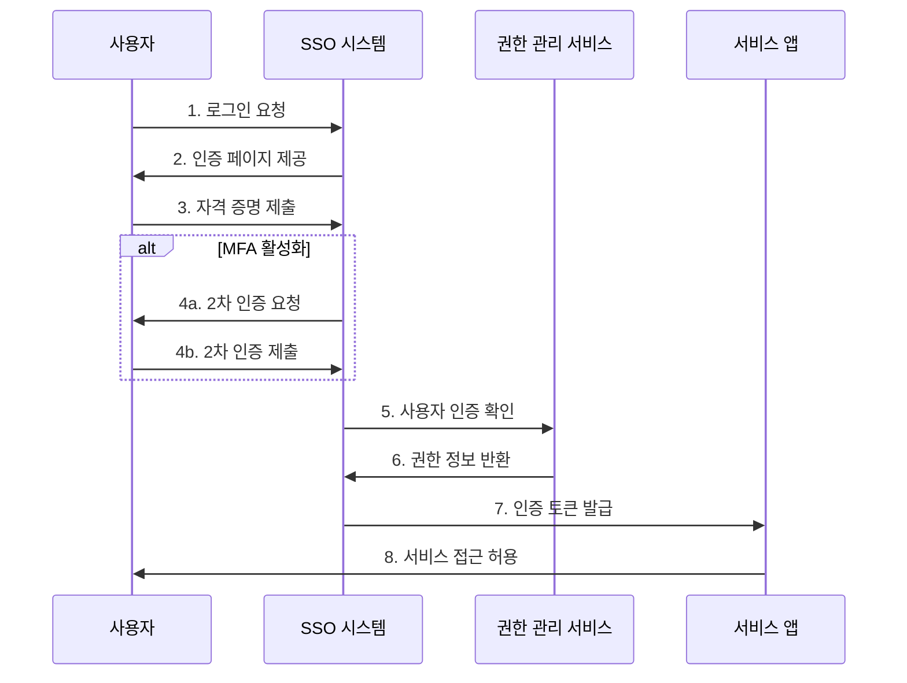
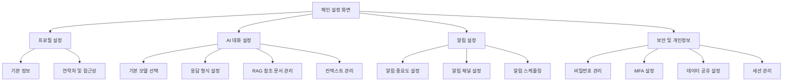
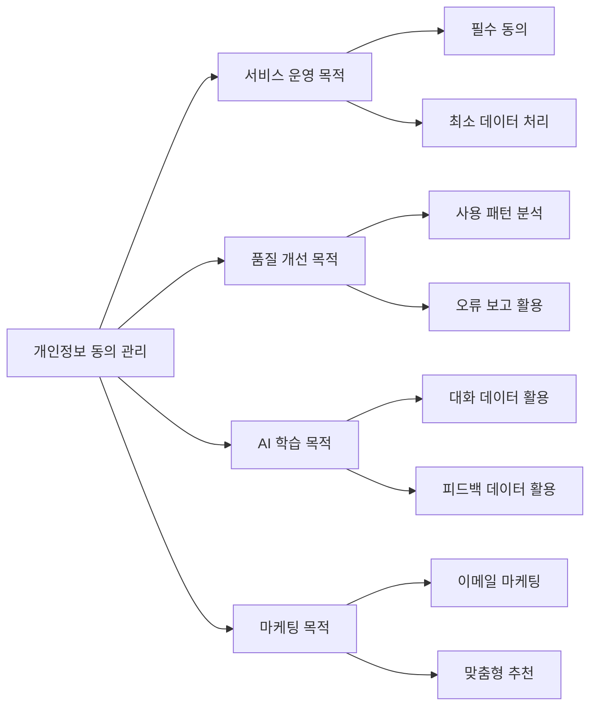
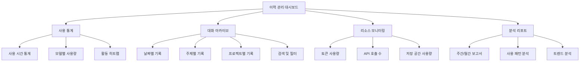
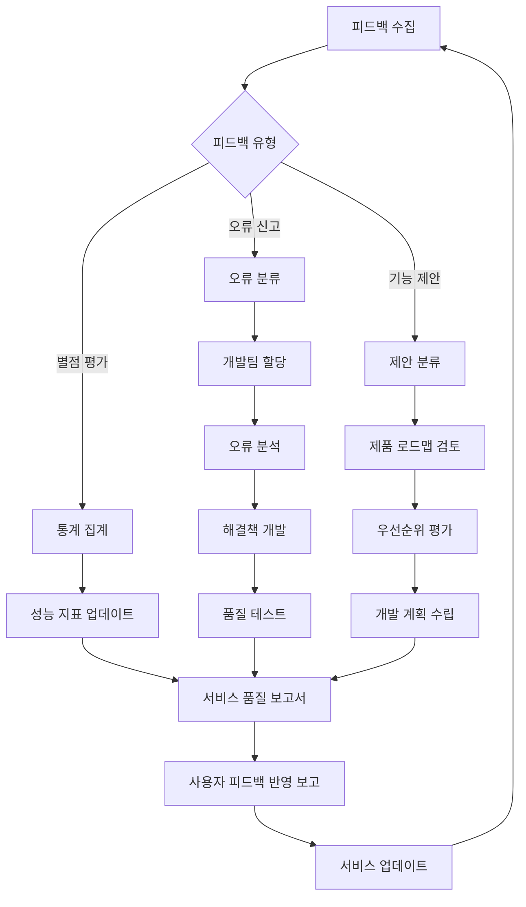
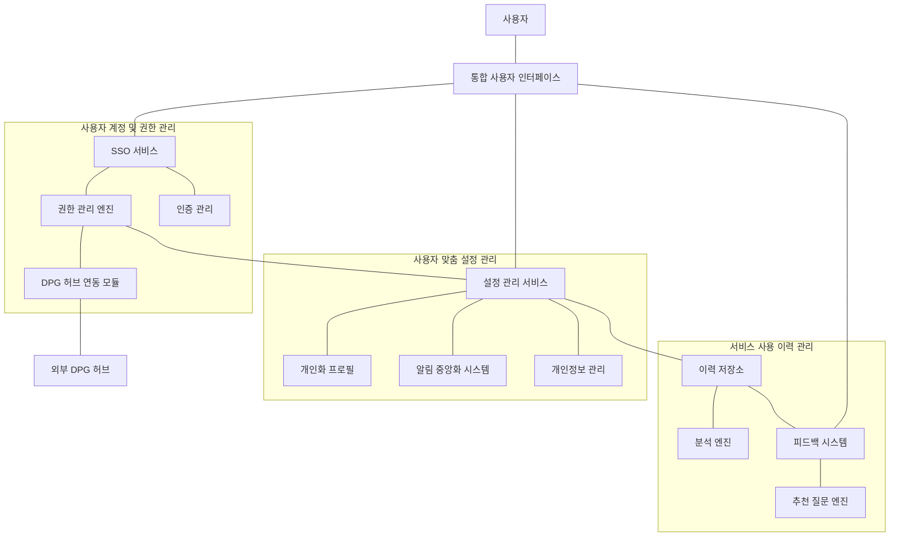

### 1. 사용자 계정 및 권한 관리 체계

#### 1.1 통합 권한 관리 시스템

- **다층적 권한 설계**: 서비스 접근, LLM 모델 사용, RAG 데이터 접근까지 세분화된 권한 체계 구축
- **역할 기반 접근 제어(RBAC)**: 관리자, 개발자, 일반 사용자 등 역할별 권한 부여
- **DPG 허브 연동 인터페이스**: 기존 DPG 허브의 권한 정보를 실시간으로 연계하는 API 구현
- **권한 위임 기능**: 프로젝트/팀 단위 권한 위임 및 관리 기능

**통합 권한 관리 체계도**

|권한 레벨|공통 서비스 접근|LLM 모델 사용|RAG 데이터 접근|관리 기능|
|---|---|---|---|---|
|시스템 관리자|전체 접근|전체 모델 접근|전체 데이터 접근|권한 설정, 사용자 관리|
|조직 관리자|조직 내 전체 접근|할당된 모델 접근|조직 데이터 접근|조직 내 권한 관리|
|프로젝트 관리자|프로젝트 서비스 접근|프로젝트 할당 모델|프로젝트 데이터|프로젝트 멤버 관리|
|개발자|개발 도구 접근|개발용 모델 접근|개발 데이터 접근|API 키 관리|
|일반 사용자|기본 서비스 접근|기본 모델 접근|공개 데이터 접근|개인 설정 관리|

#### 1.2 강화된 인증 시스템

- **SSO 통합 인증**: 기업 내 타 시스템과의 원활한 연동을 위한 SAML/OAuth 기반 SSO 구현
- **다중 인증(MFA)**: 보안 강화를 위한 선택적 이중 인증 시스템 제공
- **세션 관리 최적화**: 유휴 시간 감지 및 자동 로그아웃, 세션 하이재킹 방지 기능
- **인증 이력 추적**: 로그인/로그아웃 기록 및 이상 접속 탐지 시스템

**인증 프로세스 다이어그램**

mermaid

### 2. 사용자 맞춤 설정 관리

#### 2.1 직관적인 설정 인터페이스

- **대시보드 커스터마이징**: 사용자가 자주 사용하는 기능 중심의 UI 배치 옵션
- **개인화 설정 프로필**:
    - 기본 LLM 모델 및 매개변수 설정
    - RAG 참조 문서 우선순위 지정
    - AI 응답 형식 및 길이 설정
- **알림 중앙화**: 중요도별 알림 설정 및 알림 수신 채널(이메일, 앱 내 알림 등) 선택 기능
- **대화 컨텍스트 관리**: 대화 기록 보존 기간 및 컨텍스트 유지 설정

**사용자 설정 UI 구조**

mermaid

**개인화 설정 옵션**

|설정 카테고리|설정 옵션|설명|
|---|---|---|
|AI 모델 설정|기본 LLM 모델|기본적으로 사용할 AI 모델 선택 (예: GPT-4, Claude 3 등)|
||매개변수 프리셋|Temperature, Top-p 등 응답 생성 매개변수 설정|
||토큰 제한|최대 입출력 토큰 수 설정|
|RAG 설정|기본 문서 소스|참조할 기본 문서 저장소 지정|
||문서 우선순위|참조 문서 간 우선순위 설정|
||검색 깊이|RAG 검색 범위 및 깊이 설정|
|응답 형식|응답 길이|간결/표준/상세 등 응답 상세도 설정|
||응답 형식|텍스트, 마크다운, 표, 다이어그램 등 선호 형식|
||코드 형식|코드 블록 스타일 및 문법 강조 설정|
|대화 관리|기록 보존 기간|대화 기록 자동 삭제 기간 설정|
||컨텍스트 윈도우|대화 컨텍스트로 유지할 이전 메시지 수|
||새 대화 주기|자동으로 새 대화를 시작할 비활성 시간|

#### 2.2. 개인정보 보호 설정

- **정보 공개 수준 제어**: 사용자 활동 이력, 피드백 등의 공개 범위 설정
- **데이터 처리 동의 관리**: 개인정보 활용 범위에 대한 세부 동의 관리 시스템
- **데이터 삭제 요청 처리**: GDPR 등 규정 준수를 위한 사용자 데이터 삭제 요청 기능

**데이터 처리 동의 관리 체계**

mermaid

### 3. 서비스 사용 이력 관리

#### 3.1 통합 이력 관리 시스템

- **이력 시각화 대시보드**: 서비스 사용 패턴을 직관적으로 파악할 수 있는 시각화 도구
- **대화 아카이브 기능**: 날짜/주제/프로젝트별 대화 이력 검색 및 필터링
- **이력 데이터 내보내기**: CSV, JSON 형식으로 사용 이력 데이터 추출 기능
- **사용량 분석 리포트**: 개인/팀별 사용량 통계 및 리소스 활용 패턴 분석

**이력 관리 대시보드 구성**

mermaid

**사용자 이력 데이터 구조**

|데이터 유형|저장 항목|보존 기간|접근 권한|
|---|---|---|---|
|대화 기록|입력 프롬프트, AI 응답, 타임스탬프|사용자 설정에 따라 30~90일|사용자, 관리자|
|사용량 통계|사용 시간, 토큰 사용량, 세션 수|12개월|사용자, 관리자|
|설정 변경 이력|변경 내용, 변경 시간, 변경자|6개월|사용자, 관리자|
|로그인 이력|로그인 시간, IP, 디바이스 정보|3개월|사용자, 보안 관리자|
|오류 보고|오류 유형, 발생 시점, 컨텍스트|6개월|개발자, 관리자|

#### 3.2 인터랙티브 피드백 시스템

- **다차원 피드백 메커니즘**:
    - 답변 정확성, 관련성, 유용성에 대한 별점 평가
    - 오류 신고 시 카테고리별 분류 및 상세 설명 입력 기능
- **AI 추천 질문 엔진**:
    - 사용자 맥락 및 이전 질문 기반의 지능형 추천 질문 생성
    - 도메인별 인기 질문 큐레이션 및 실시간 업데이트
- **피드백 루프 시스템**: 사용자 피드백이 서비스 개선에 반영되는 과정 시각화

**피드백 처리 프로세스**

mermaid

**추천 질문 시스템 구성**

|추천 유형|생성 방식|표시 위치|활용 효과|
|---|---|---|---|
|컨텍스트 기반 질문|현재 대화 맥락에서 자연스러운 후속 질문 생성|대화창 하단|대화 확장 및 심화|
|인기 질문|유사 사용자들의 질문 데이터 기반 추천|사이드바|서비스 탐색 유도|
|도메인 질문|특정 도메인/주제에 특화된 최적 질문 큐레이션|주제별 탭|전문성 향상|
|신규 기능 가이드|최신 업데이트된 기능 활용을 위한 질문|알림 연계|신규 기능 채택률 향상|
|문제해결 질문|자주 발생하는 오류나 문제 해결을 위한 질문|오류 발생 시 표시|사용자 지원 강화|

## 기대 효과

- **업무 효율성 증대**: 직관적인 인터페이스와 개인화 설정으로 작업 효율 향상
- **보안 강화**: 세분화된 권한 관리로 데이터 및 리소스 보호 강화
- **사용자 만족도 향상**: 맞춤형 설정 및 피드백 반영으로 사용자 경험 개선
- **데이터 기반 의사결정**: 사용 패턴 분석을 통한 서비스 개선 방향 도출

**기대 효과 측정 지표**

|효과 영역|주요 KPI|측정 방법|목표 개선률|
|---|---|---|---|
|업무 효율성|작업 완료 시간|태스크 완료 시간 측정|20% 감소|
||반복 태스크 수|동일 작업 반복 횟수|30% 감소|
|보안 강화|보안 사고 발생률|보안 침해 사고 수|50% 감소|
||불필요한 권한 접근|권한 감사 결과|70% 감소|
|사용자 만족도|NPS 점수|사용자 추천 의향 조사|40% 향상|
||활성 사용자 수|월간 활성 사용자|25% 증가|
|데이터 기반 개선|기능 활용률|핵심 기능 사용 비율|35% 증가|
||서비스 개선 주기|개선 릴리스 주기|30% 단축|

## 종합 시스템 아키텍처

mermaid

본 제안서는 사용자 중심 설계 원칙을 바탕으로, 안전하고 효율적인 사용자 관리 시스템 구축을 위한 종합적인 방안을 제시합니다.