○ 플랫폼 정보 관리 기능
- 민간 AI 플랫폼 정보 등록 기능(민간 AI 플랫폼의 AI 서비스, 모듈 서비스, 모델 카탈로그 연계 정보) : 두 개 이상의 민간 AI 플랫폼으로부터 플랫폼 정보, 플랫폼 하위의 AI 모델 및 서비스 카탈로그 정보를 연계해야 함 (아래 언급된 연계 데이터 항목 등을 정의하여 각 민간 AI 플랫폼이 표준화된 형태로 관련 항목을 연계하도록 제시 필요)

○ 플랫폼 통합 관제 기능 
- 플랫폼 모니터링 연계 항목 정의 및 데이터 연계 (민간 AI 플랫폼) : 시간의 흐름에 따라 주요 모니터링 항목 그래프로 표출하는 기능 제공해야 함

○ AI 모델 카탈로그 구현을 위한 기획 
- 수집 필수 항목 : 모델명, 모델 상세 내용(모델 인증 정보, 공공 학습데이터), 모델 크기, 멀티모달 여부, 모델사명, 강점 및 특이사항 등

○ 서비스 카탈로그 구현을 위한 기획 
- 수집 필수 항목 : 서비스명, 서비스 상세 내용, 서비스 대상, 모델명, 모델 학습 여부, 모델 학습 방법 및 학습데이터 예시, RAG 활용 여부, RAG 대상 문서명 일부, 서비스 개발 기간, 개시일, 이용현황, (공통기반 통한 개발인 경우) 개발에 활용한 기능 모듈명, 특이사항 등

○ AI 모델/서비스 카탈로그 관리 기능 
- AI 모델/서비스 카탈로그 정보 연계 기능 : 플랫폼 정보로부터 조회 가능한 각 민간 AI 플랫폼 상의 표준화된 카탈로그 연계 API를 호출하여 AI 모델 및 AI 서비스 카탈로그 정보를 연계해야 함 
- AI 모델/서비스 정보 조회 (RAG정보, 모델정보, 평가결과 등) : 연계한 AI 모델 /서비스 카탈로그 정보를 조회할 수 있는 페이지 (키워드 검색, 리스트 조회, 클릭 시 상세조회) 제공해야 함

# 공공 AI 플랫폼 통합관리시스템 제안서

## 플랫폼 관리 기능 구현 방안

### 1. 플랫폼 정보 관리 기능

#### 민간 AI 플랫폼 정보 통합 연계 솔루션

저희 솔루션은 두 개 이상의 민간 AI 플랫폼으로부터 표준화된 데이터 연계를 통해 효율적인 플랫폼 정보 관리 체계를 구현합니다. 플랫폼 간 정보 연계를 위한 표준화된 데이터 형식과 API 인터페이스를 제공하여 플랫폼 통합 관리의 효율성을 극대화합니다.

**연계 데이터 표준화 방안**

| 구분         | 연계 항목    | 설명              |
| ---------- | -------- | --------------- |
| 플랫폼 기본 정보  | 플랫폼 ID   | 플랫폼 고유 식별자      |
|            | 플랫폼 명칭   | 플랫폼 서비스명        |
|            | 플랫폼 버전   | 현재 운영 중인 버전 정보  |
|            | 운영 기관    | 플랫폼 운영 담당 기관    |
|            | 최초 등록일   | 플랫폼 등록 일자       |
|            | 최종 업데이트일 | 최근 정보 갱신 일자     |
| AI 모델 카탈로그 | 모델 분류체계  | 모델 유형 및 분류 정보   |
|            | 모델 상세정보  | 모델 특성 및 성능 정보   |
|            | 인증정보     | 모델 안정성/보안 인증 정보 |
| 서비스 카탈로그   | 서비스 분류체계 | 서비스 유형 및 분류 정보  |
|            | 개발정보     | 서비스 개발 이력 및 방식  |
|            | 운영정보     | 서비스 운영 현황 정보    |

**플랫폼 정보 연계 아키텍처**

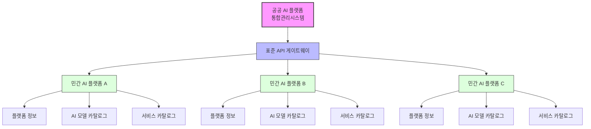

**연계 API 시퀀스 다이어그램**

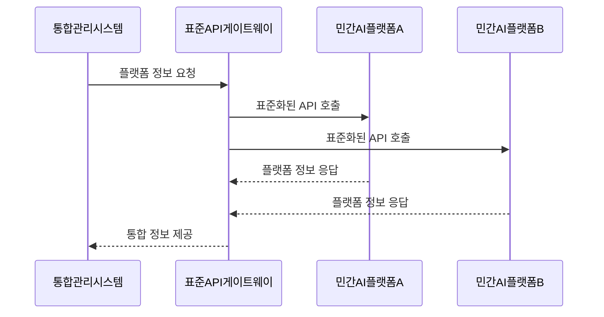

### 2. 플랫폼 통합 관제 기능

#### 실시간 모니터링 대시보드

통합 관제 시스템은 민간 AI 플랫폼들의 주요 지표를 실시간으로 수집하여 직관적인 대시보드 형태로 제공합니다. 이를 통해 관리자는 각 플랫폼의 성능과 상태를 효과적으로 모니터링할 수 있습니다.

**주요 모니터링 항목**

| 구분 | 모니터링 항목 | 측정 주기 | 표시 방식 |
|------|--------------|---------|----------|
| 시스템 성능 지표 | CPU/GPU 사용률 | 실시간(5초) | 선형 그래프 |
|  | 메모리 사용률 | 실시간(5초) | 선형 그래프 |
|  | 네트워크 트래픽 | 실시간(5초) | 선형 그래프 |
| 서비스 사용 지표 | API 호출 횟수 | 5분 | 막대 그래프 |
|  | 동시 사용자 수 | 1분 | 선형 그래프 |
|  | 평균 응답 시간 | 5분 | 선형 그래프 |
| AI 모델 운영 지표 | 추론 처리량 | 10분 | 막대 그래프 |
|  | 모델 정확도 | 1시간 | 게이지 차트 |
|  | 오류 발생률 | 10분 | 선형 그래프 |

**통합 관제 시스템 아키텍처**

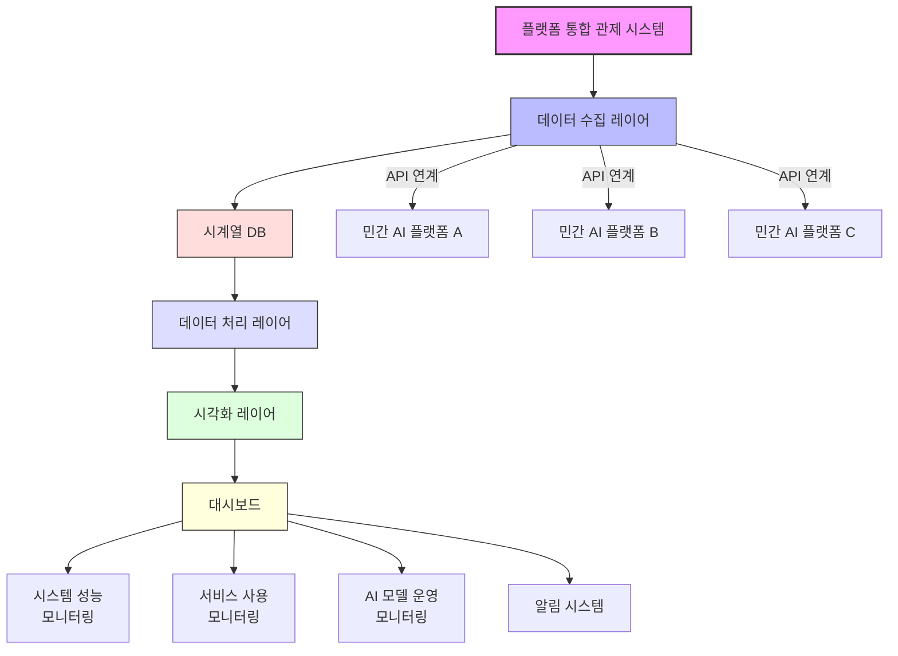

**모니터링 데이터 흐름도**

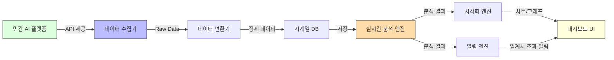

### 3. AI 모델 카탈로그 구현 방안

AI 모델 카탈로그는 여러 민간 AI 플랫폼에서 제공하는 다양한 AI 모델 정보를 통합하여 제공합니다. 수집된 정보는 사용자가 쉽게 검색하고 비교할 수 있도록 직관적인 인터페이스로 구성됩니다.

**카탈로그 수집 항목**

| 항목 구분 | 세부 항목 | 필수 여부 | 설명 |
|----------|-----------|----------|------|
| 기본 정보 | 모델명 | 필수 | AI 모델의 공식 명칭 |
|  | 버전 | 필수 | 모델 버전 정보 |
|  | 개발사 | 필수 | 모델 개발 기관/회사 |
|  | 라이선스 유형 | 필수 | 오픈소스/상용 등 구분 |
| 상세 정보 | 모델 아키텍처 | 필수 | 모델 구조 정보 |
|  | 모델 크기 | 필수 | 파라미터 수 |
|  | 학습 데이터셋 정보 | 필수 | 학습에 사용된 데이터 정보 |
| 성능 정보 | 벤치마크 결과 | 선택 | 표준 벤치마크 테스트 결과 |
|  | 정확도 | 선택 | 모델 정확도 지표 |
|  | 처리 속도 | 선택 | 추론 속도 정보 |
| 활용 정보 | 멀티모달 여부 | 필수 | 멀티모달 지원 여부 |
|  | 지원 언어 | 필수 | 지원하는 언어 목록 |
|  | 추천 활용 사례 | 선택 | 주요 활용 사례 예시 |
| 인증 정보 | 공공 AI 모델 인증 여부 | 필수 | 공공 분야 인증 정보 |
|  | 공공 학습데이터 활용 여부 | 필수 | 공공데이터 활용 여부 |
| 특이사항 | 모델 강점 | 선택 | 모델의 주요 특징 및 강점 |
|  | 주의사항 | 선택 | 활용 시 주의해야 할 사항 |
|  | 제한사항 | 선택 | 모델 사용 제한 조건 |

**AI 모델 카탈로그 ER 다이어그램**

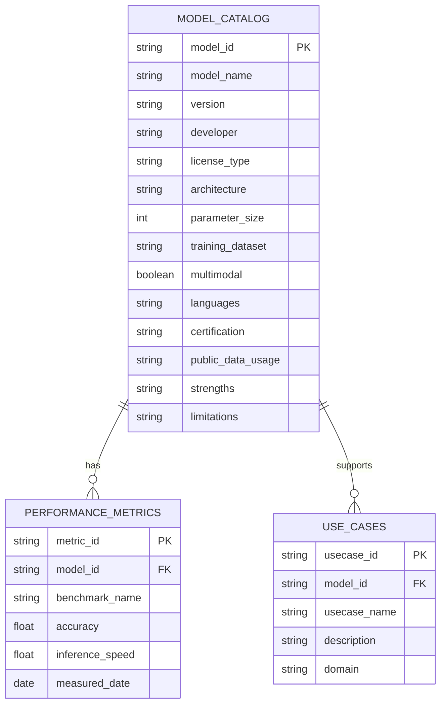

**AI 모델 카탈로그 관리 프로세스**

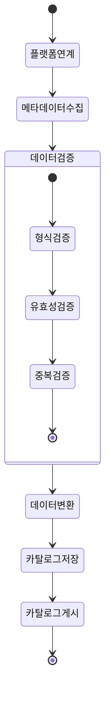

### 4. 서비스 카탈로그 구현 방안

서비스 카탈로그는 AI 모델을 활용한 다양한 서비스 정보를 체계적으로 분류하여 제공합니다. 사용자는 목적에 맞는 AI 서비스를 쉽게 찾고 활용할 수 있습니다.

**카탈로그 수집 항목**

| 항목 구분 | 세부 항목 | 필수 여부 | 설명 |
|----------|-----------|----------|------|
| 서비스 기본 정보 | 서비스명 | 필수 | AI 서비스의 공식 명칭 |
|  | 제공자 | 필수 | 서비스 제공 기관/회사 |
|  | 개시일 | 필수 | 서비스 개시 일자 |
|  | 서비스 유형 | 필수 | 서비스 분류 정보 |
| 서비스 상세 정보 | 기능 설명 | 필수 | 서비스 주요 기능 설명 |
|  | 활용 사례 | 선택 | 서비스 활용 예시 |
|  | 서비스 대상 | 필수 | 주요 대상 사용자 그룹 |
| 기술 정보 | 적용 모델명 | 필수 | 사용된 AI 모델명 |
|  | 모델 학습 여부 | 필수 | 추가 학습 여부 |
|  | 학습 방법 | 조건부 필수 | 학습 진행 시 방법론 |
|  | 학습데이터 예시 | 조건부 필수 | 학습에 사용된 데이터 예시 |
| RAG 관련 정보 | RAG 활용 여부 | 필수 | RAG 기술 적용 여부 |
|  | RAG 대상 문서 정보 | 조건부 필수 | RAG에 활용된 문서 정보 |
| 개발 정보 | 개발 기간 | 필수 | 서비스 개발에 소요된 기간 |
|  | 활용 기능 모듈명 | 조건부 필수 | 공통기반 활용 시 모듈명 |
| 운영 정보 | 이용자 수 | 필수 | 현재 서비스 이용자 수 |
|  | 호출 횟수 | 필수 | 서비스 API 호출 통계 |
|  | 만족도 | 선택 | 사용자 만족도 정보 |

**서비스 카탈로그 ER 다이어그램**

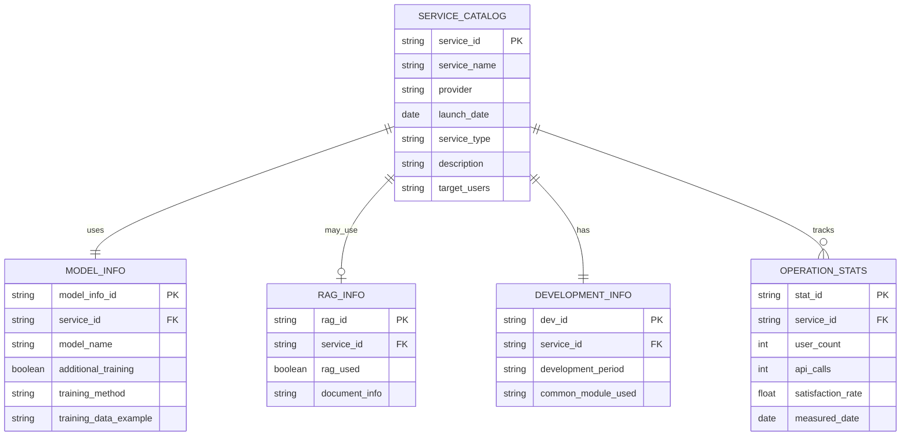

**서비스 카탈로그 구성도**

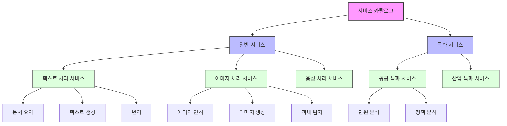

### 5. AI 모델/서비스 카탈로그 관리 기능

#### 표준화된 카탈로그 연계 시스템

민간 AI 플랫폼과의 효율적인 정보 연계를 위한 표준화된 API 인터페이스를 구현합니다. 이를 통해 다양한 플랫폼의 AI 모델 및 서비스 정보를 실시간으로 수집하고 관리합니다.

**연계 시스템 아키텍처**

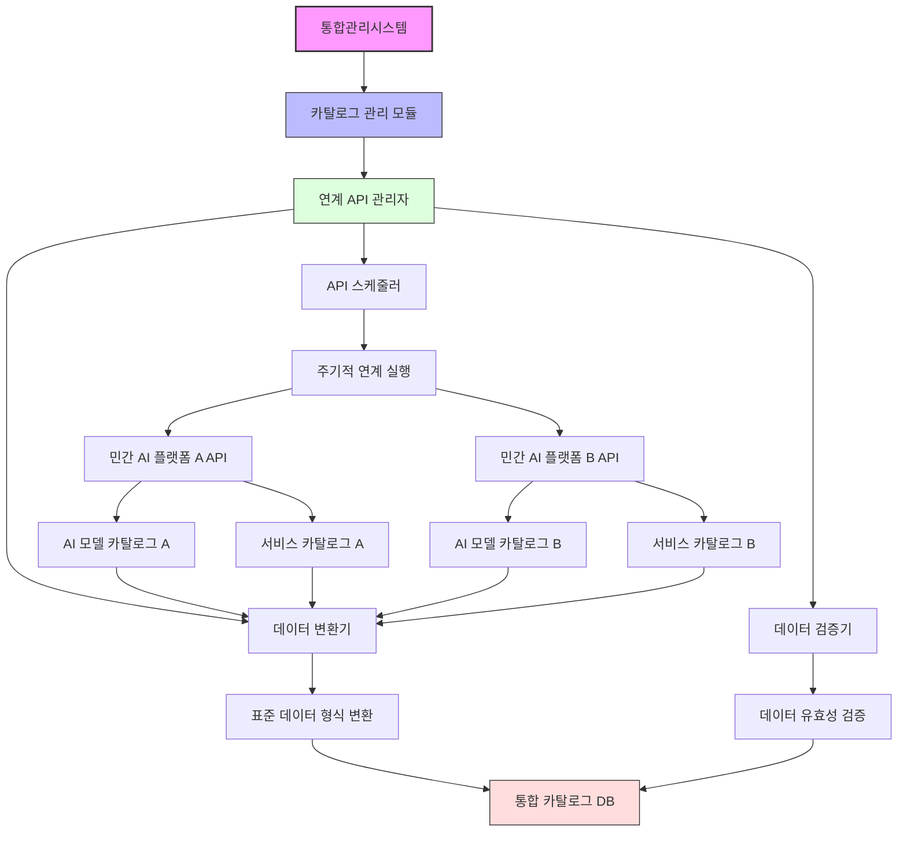

**카탈로그 연계 프로세스 흐름도**

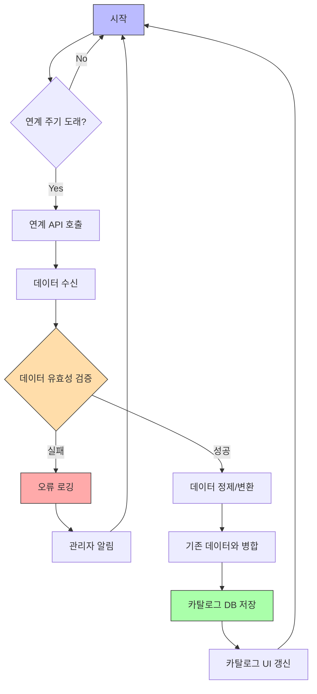

#### 직관적인 카탈로그 조회 서비스

사용자가 필요한 AI 모델 및 서비스를 쉽게 찾고 비교할 수 있는 사용자 친화적 인터페이스를 제공합니다.

**카탈로그 조회 시스템 기능 구성**

| 기능 구분 | 세부 기능 | 설명 |
|----------|-----------|------|
| 키워드 검색 | 통합 검색 | 전체 카탈로그 대상 키워드 검색 |
|  | 카테고리별 검색 | 특정 카테고리 내 검색 |
|  | 태그 기반 검색 | 태그 정보 기반 검색 |
| 필터링 | 모델 크기 필터 | 모델 크기별 필터링 |
|  | 멀티모달 필터 | 멀티모달 지원 여부 필터링 |
|  | 성능 지표 필터 | 성능 지표 기준 필터링 |
|  | 활용 분야 필터 | 활용 분야별 필터링 |
| 상세 정보 조회 | 기본 정보 뷰 | 기본 정보 조회 화면 |
|  | 상세 정보 뷰 | 상세 정보 조회 화면 |
|  | 성능 지표 뷰 | 성능 정보 시각화 화면 |
|  | 활용 사례 뷰 | 활용 사례 조회 화면 |
| 비교 기능 | 모델 비교 | 선택 모델간 특성 비교 |
|  | 서비스 비교 | 선택 서비스간 기능 비교 |
|  | 비교표 생성 | 비교 결과 테이블 생성 |

**카탈로그 검색 프로세스**

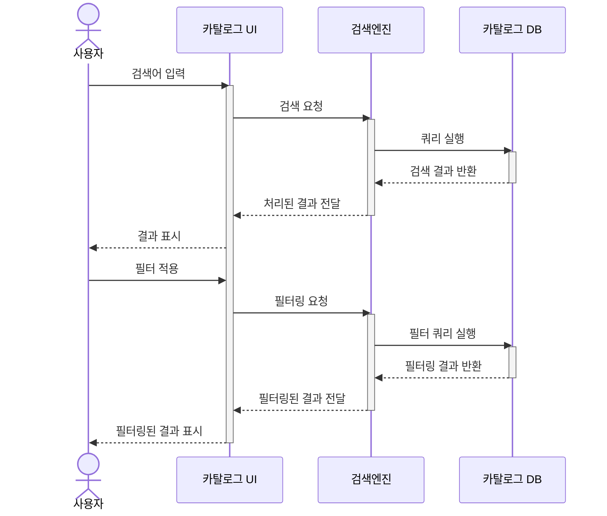

**카탈로그 비교 기능 구조도**

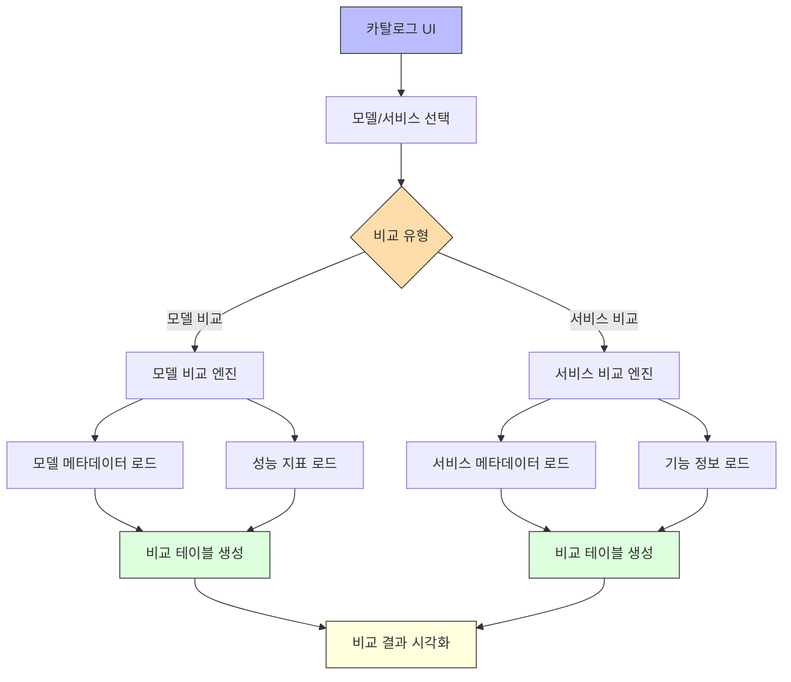

## UI/UX 디자인 제안

### 플랫폼 통합 관제 대시보드

통합 관제 대시보드는 직관적인 시각화를 통해 관리자가 여러 플랫폼의 상태를 한눈에 파악할 수 있도록 설계했습니다.

**대시보드 컴포넌트 아키텍처**

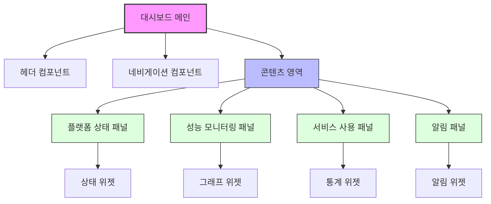

**대시보드 디자인 특징**

| 구성 요소 | 설명 | 상호작용 |
|----------|------|----------|
| 모듈형 위젯 | 사용자 선택에 따라 구성 가능한 위젯 | 드래그 앤 드롭으로 위치 조정 |
| 성능 지표 그래프 | 시계열 데이터 시각화 | 시간 범위 조절, 확대/축소 |
| 상태 표시등 | 시스템 상태 직관적 표시 | 클릭 시 상세 정보 표시 |
| 알림 패널 | 중요 이벤트 알림 표시 | 필터링, 정렬 기능 |
| 플랫폼 선택기 | 모니터링 대상 플랫폼 선택 |

